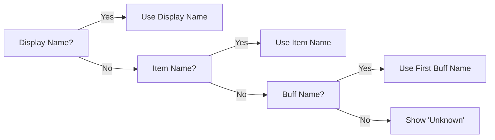

## Item Types

RCC supports two types of entries:

<Tabs>
  <Tab title="Consumable">
    Physical items you carry in your bags (flasks, potions, food, oils).
    
    **Features:**
    - Inventory count tracking
    - Click-to-use functionality
    - Buff status monitoring (optional)
    - Required count alerts
    
    **Use for:** Flask of Supreme Power, Major Healing Potion, Wizard Oil, etc.
  </Tab>
  <Tab title="Buff">
    Class buffs or auras without physical items (Arcane Intellect, Mark of the Wild).
    
    **Features:**
    - Buff status monitoring only
    - No inventory tracking
    - Multiple buff variants support
    - Visual reminder system
    
    **Use for:** Arcane Intellect, Power Word: Fortitude, Thorns, etc.
  </Tab>
</Tabs>

<Note>
  Toggle between types using the checkboxes at the top of the item configuration form.
</Note>

## Configuration Fields

### Essential Fields

<ParamField path="itemName" type="string" required>
  **Exact** name of the item as it appears in your bags.
  
  - Case-sensitive: `Major Healing Potion` ≠ `major healing potion`
  - Required for inventory tracking and click-to-use
  - Disabled when Type is set to "Buff"
  
  **Example:** `Flask of Supreme Power`
</ParamField>

<ParamField path="buffName" type="string | string[]" required>
  Name(s) of the buff to track in your buff bar.
  
  - Case-sensitive: `Supreme Power` ≠ `supreme power`
  - Supports multiple buffs: `Arcane Intellect, Arcane Brilliance`
  - Special keyword: `EQUIPPED_WEAPON` for weapon enchants
  - Border color changes based on buff status
  
  **Example:** `Supreme Power`
  
  **Multiple Buffs:** `Arcane Intellect, Arcane Brilliance`
</ParamField>

<ParamField path="iconPath" type="string" required>
  Icon name for the visual display.
  
  - Just the icon name: `INV_Potion_41` (not full path)
  - Preview updates in real-time as you type
  - Fallback to question mark if invalid
  
  **Example:** `INV_Potion_41`
  
  <Tip>
    Find icon names on [Wowhead Classic](https://web.archive.org/web/20230524183438/https://www.wowhead.com/classic/)
  </Tip>
</ParamField>

### Optional Fields

<ParamField path="displayName" type="string">
  Custom label shown under the icon.
  
  - Overrides itemName and buffName for display
  - Useful for shortening long names
  - Leave empty to use itemName or buffName
  
  **Example:** `Mage Int` (instead of "Arcane Intellect")
</ParamField>

<ParamField path="requiredCount" type="number" default="1">
  Target quantity to carry.
  
  - Shows green when you have enough
  - Shows red when you need more
  - Set to 0 to hide counter
  - Disabled for Buff type
  
  **Example:** `10` (for potions)
</ParamField>

<ParamField path="itemID" type="number">
  WoW item ID (reference only).
  
  - Not used for any logic
  - Helpful for documentation
  - Disabled for Buff type
  
  **Example:** `13512` (Flask of Supreme Power)
</ParamField>

<ParamField path="description" type="string">
  Extra text shown in tooltips.
  
  - Appears when hovering over the icon
  - Supports multi-line text
  - Auto-expands as you type
  
  **Example:** `Increases damage done by magical spells and effects by up to 150 for 2 hrs.`
</ParamField>

<ParamField path="category" type="string" required>
  Which category group this item belongs to.
  
  - Automatically set based on selection
  - Can be changed by moving item to different category
  - Must match a valid category ID
  
  **Example:** `category1`
</ParamField>

## Field Behavior by Type

<CodeGroup>
```lua Consumable Type
{
  entryType = "consumable",
  itemName = "Flask of Supreme Power",  -- ✅ Enabled
  requiredCount = 1,                     -- ✅ Enabled
  itemID = 13512,                        -- ✅ Enabled
  buffName = "Supreme Power",            -- ✅ Optional
  displayName = "",                      -- ✅ Optional
  iconPath = "INV_Potion_41",           -- ✅ Required
  description = "..."                    -- ✅ Optional
}
```

```lua Buff Type
{
  entryType = "buff",
  itemName = "",                         -- ❌ Disabled (grayed out)
  requiredCount = 0,                     -- ❌ Disabled (grayed out)
  itemID = 0,                            -- ❌ Disabled (grayed out)
  buffName = "Arcane Intellect",         -- ✅ Required
  displayName = "Mage Int",              -- ✅ Optional
  iconPath = "SPELL_Holy_Magicalsentry", -- ✅ Required
  description = "..."                    -- ✅ Optional
}
```
</CodeGroup>

## Special Features

### EQUIPPED_WEAPON Keyword

For tracking weapon enchants like **Wizard Oil**, **Sharpening Stones**, and **Rogue Poisons**:

<Steps>
  <Step title="Set buffName to EQUIPPED_WEAPON">
    Use the special keyword instead of a buff name:
    
    ```lua
    buffName = "EQUIPPED_WEAPON"
    ```
  </Step>
  
  <Step title="Configure the item normally">
    Set itemName, requiredCount, and iconPath as usual:
    
    ```lua
    itemName = "Wizard Oil"
    requiredCount = 4
    iconPath = "INV_Potion_104"
    ```
  </Step>
  
  <Step title="Border reflects enchant status">
    - 🟢 Green: Weapon is enchanted with &gt;5 min remaining
    - 🟠 Orange: Weapon enchant &lt;5 min remaining
    - 🔴 Red: No weapon enchant detected
  </Step>
</Steps>

<Warning>
  EQUIPPED_WEAPON only tracks your **main hand** weapon enchant.
</Warning>

### Multiple Buff Variants

Some buffs have single-target and group versions (e.g., Arcane Intellect vs Arcane Brilliance):

<CodeGroup>
```lua Single Buff
buffName = "Arcane Intellect"
```

```lua Multiple Buffs
buffName = { "Arcane Intellect", "Arcane Brilliance" }
-- In UI: Enter as comma-separated
-- "Arcane Intellect, Arcane Brilliance"
```
</CodeGroup>

**Behavior:**
- Border turns green if **any** variant is active
- First buff name used for display label
- All variants shown in tooltip

### Display Name Priority

The addon chooses which label to show under the icon:



**Priority:**
1. **displayName** (if provided)
2. **itemName** (if provided)
3. **buffName** (first variant if multiple)
4. **"Unknown"** (fallback)

## Adding Items via UI

<Steps>
  <Step title="Click 'New Item'">
    Opens a blank form with default values.
  </Step>
  
  <Step title="Choose Type">
    Select "Consumable" or "Buff" at the top.
  </Step>
  
  <Step title="Fill Required Fields">
    At minimum:
    - Item Name **OR** Buff Name (at least one)
    - Icon Name (recommended)
  </Step>
  
  <Step title="Preview Icon">
    Icon preview appears on the right as you type.
  </Step>
  
  <Step title="Click Save">
    Save button enables when all required fields are valid.
  </Step>
</Steps>

<Tip>
  Use **Tab** to quickly move between fields while filling the form.
</Tip>

## Editing Items

<Steps>
  <Step title="Select from List">
    Click an item in the left panel to load it.
  </Step>
  
  <Step title="Modify Fields">
    Change any field values as needed.
  </Step>
  
  <Step title="Validation">
    Save button enables only if changes are valid.
  </Step>
  
  <Step title="Save or Discard">
    - **Save**: Apply changes
    - **Discard**: Revert to original values
  </Step>
</Steps>

## Common Mistakes

<Warning>
  **Case Sensitivity**
  
  All names are case-sensitive:
  
  ❌ `supreme power` → Won't match buff  
  ✅ `Supreme Power` → Correct
  
  ❌ `major healing potion` → Won't find item  
  ✅ `Major Healing Potion` → Correct
</Warning>

<Warning>
  **Icon Path Format**
  
  Use shorthand, not full paths:
  
  ❌ `Interface\\Icons\\INV_Potion_41` → Too verbose  
  ✅ `INV_Potion_41` → Correct
  
  ❌ `INV Potion 41` → Spaces not allowed  
  ✅ `INV_Potion_41` → Correct
</Warning>

<Warning>
  **Instant Effect Items**
  
  Don't add buffName to healing/mana potions:
  
  ❌ Adding a buffName to Major Healing Potion → Border stays red  
  ✅ Leave buffName empty → Border shows black (no buff to track)
</Warning>

<Warning>
  **Auto-Conversion to Buff**
  
  If you save a Consumable with:
  - Empty itemName
  - requiredCount = 0
  - Valid buffName
  
  The addon automatically converts it to Buff type to keep the UI clean.
</Warning>

## Reordering Items

Use the **Up** and **Down** buttons to change display order:

- **Within Category**: Move item up/down in the same category
- **Between Categories**: Move past category header to switch categories
- **Real-time Update**: Main window reflects changes immediately

<Note>
  Reordering a category (see [Categories](/configuration/categories)) moves all its items as a block.
</Note>

## Next Steps

<CardGroup cols={2}>
  <Card title="Categories" icon="folder" href="/configuration/categories">
    Learn how to organize items into categories
  </Card>
  <Card title="Examples" icon="code" href="/configuration/examples">
    See real configuration examples
  </Card>
</CardGroup>