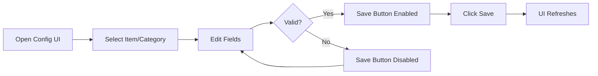

## Configuration System

Raid Consumable Checker v2.0+ features a powerful **in-game configuration UI** that allows you to customize your consumable tracking without editing files manually.

### Access Configuration

There are two ways to access the configuration menu:

1. **Config Button**: Click the "Config" button in the main RCC window
2. **Slash Command**: Use `/rcc config` (if available)

### What You Can Configure

The configuration system allows you to manage:

<CardGroup cols={2}>
  <Card title="Items & Consumables" icon="flask">
    Add, edit, and delete consumables like flasks, potions, food, and weapon enchants. Track both inventory counts and buff status.
  </Card>
  <Card title="Categories" icon="folder">
    Organize your consumables into custom groups like "Flasks", "Main Elixirs", "Potions", and "Buffs".
  </Card>
  <Card title="Display Order" icon="arrow-up-arrow-down">
    Reorder items and categories to match your preferences using the Up/Down buttons.
  </Card>
  <Card title="Advanced Settings" icon="sliders">
    Customize colors, fonts, timers, and window dimensions via the Constants file.
  </Card>
</CardGroup>

## Configuration Types

### In-Game Configuration

The primary way to configure RCC. Provides a visual interface for:

- **Items Management**: Configure all item properties with instant preview
- **Categories Management**: Create and organize category groups
- **Real-time Updates**: Changes apply immediately without `/reload`
- **Tab Navigation**: Use Tab/Shift+Tab to move between fields

<Note>
  All changes made in the configuration UI are saved to `WTF/Account/[AccountName]/SavedVariables/RaidConsumableChecker.lua`
</Note>

### File-Based Configuration

For advanced customization beyond the UI:

- **Constants File**: Edit `RaidConsumableChecker_Constants.lua` for colors, fonts, dimensions, and timers
- **Direct Database**: Manual editing of SavedVariables (not recommended)

<Warning>
  Only edit the Constants file if you're comfortable with Lua. The in-game UI is the recommended approach for items and categories.
</Warning>

## Configuration Workflow



### Workflow Steps

1. **Open Configuration**: Click the Config button or use a slash command
2. **Select Entry**: Choose an existing item/category or click "New Item"/"New Category"
3. **Edit Fields**: Modify the configuration fields as needed
4. **Validate**: Save button enables only when changes are valid
5. **Save**: Click "Save" to apply changes (or "Discard" to revert)
6. **UI Updates**: Main window refreshes automatically

## Navigation Features

### Tab Navigation

Press **Tab** to cycle through form fields:

- **Tab**: Move to next field
- **Shift+Tab**: Move to previous field
- **Auto-Skip**: Disabled fields are skipped automatically

<Tip>
  Tab navigation makes it quick to fill out forms without using your mouse!
</Tip>

### Smart Validation

The configuration UI prevents invalid data:

- **Required Fields**: Save button disabled if essential fields are empty
- **Type Checking**: Numeric fields only accept numbers
- **Field Dependencies**: Changing item type (Consumable ↔ Buff) disables irrelevant fields
- **Icon Preview**: See icons in real-time as you type the icon name

## Data Storage

### SavedVariables Location

```
World of Warcraft/
└── WTF/
    └── Account/
        └── [YourAccount]/
            └── SavedVariables/
                └── RaidConsumableChecker.lua
```

This file contains:

- **Items**: All configured consumables
- **Categories**: Category definitions and order
- **Window Position**: Saved position from your last session

<Warning>
  Exit the game properly to ensure settings are saved. Using Alt+F4 may lose unsaved data.
</Warning>

### Data Migration

Upgrading from v1.x? RCC automatically migrates your old configuration:

- Imports items from `RaidConsumableChecker_Data.lua`
- Converts old format to new database structure
- Preserves all your customizations

## Next Steps

<CardGroup cols={2}>
  <Card title="Configure Items" icon="flask" href="/configuration/items">
    Learn about item fields and configuration options
  </Card>
  <Card title="Manage Categories" icon="folder" href="/configuration/categories">
    Organize consumables into custom groups
  </Card>
  <Card title="See Examples" icon="code" href="/configuration/examples">
    Real configuration examples from the source
  </Card>
  <Card title="Advanced Settings" icon="sliders" href="/configuration/advanced">
    Customize colors, fonts, and timers
  </Card>
</CardGroup>